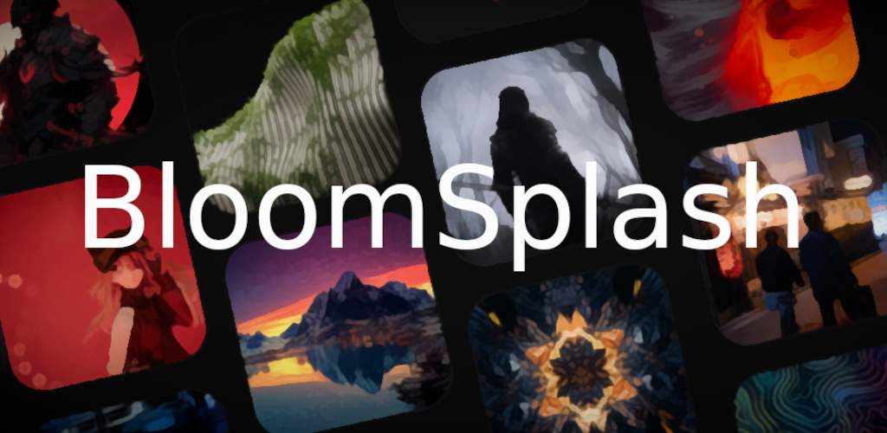

 
  
  <h3 style="font-size:1.3rem; font-weight:400; color:#00bcd4; margin-bottom:0px;">Refresh your screen. Recharge your vibe.</h3>

    
   
  <a href="https://bloomsplash.theishu.xyz" style="margin-right:10px; font-weight:500; hover:text-decoration:underline;">Visit Website</a>
  &middot;
  <a href="https://github.com/IshuSinghSE/bloomsplash/releases" style="margin-left:10px;font-weight:500; hover:text-decoration:underline;">See Releases</a>

---

  

    <strong>BloomSplash</strong> is your destination for handpicked, high-resolution wallpapers that transform your device into a canvas of beauty. 
    Whether you love minimalism, abstract art, vibrant landscapes, or moody aesthetics — we've got a splash of everything you need.
  

---

  <h3 style="font-size:1.15rem; margin-bottom:8px;">🌄 Key Features</h3>
  <ul style="list-style:none; padding:0; font-size:1.08rem; line-height:1.7;">
    <li>• 100+ curated HD wallpapers</li>
    <li>• Aesthetic collections updated weekly</li>
    <li>• Light & dark UI modes</li>
    <li>• One-tap wallpaper preview and apply</li>
    <li>• Works perfectly on all screen sizes</li>
  </ul>

---

  <h3 style="font-size:1.15rem; margin-bottom:8px;">💫 Why BloomSplash?</h3>
  

    Your device deserves art. We blend design and personalization into a seamless, elegant experience that makes every glance at your phone feel inspiring.
  

  <h3 style="font-size:1.15rem; margin-bottom:8px;">🎯 Lightweight. Fast. Ad-light. Beautiful.</h3>
  

    Download BloomSplash and turn your home screen into a mood board of visual joy.
  

---

  Made with ❤️ by Ishu Singh &middot; <a href="mailto:ishu.111636@gmail.com">Contact</a>

  

  <!-- 3D Rounded Badges -->
